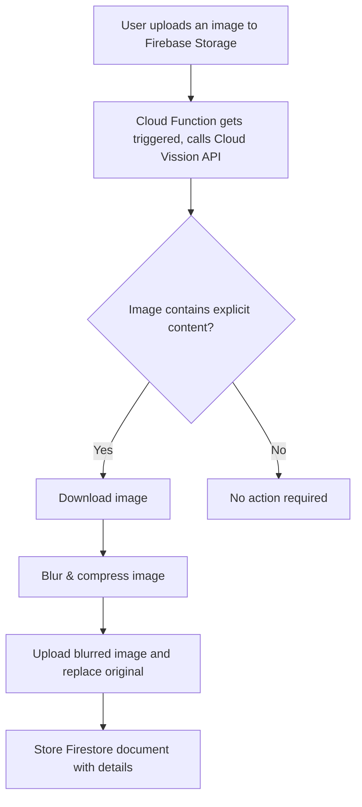

# Explicit Content Extension for Firebase

## Demo

https://github.com/nilsreichardt/explicit-content-extension/assets/24459435/57df1370-fdfd-458a-a330-428b90b90398

## What problem does this solve?

Firebase Storage is a great way to store user generated content. However, it does not provide a way to filter out explicit content. This extension uses the [Google Cloud Vision API](https://cloud.google.com/vision) to detect explicit content in images uploaded to Firebase Storage. It then blurs the image and replaces the original image with the blurred version.

## How does it work?

## Additional setup

Before installing this extension, make sure that you've [set up a Cloud Storage bucket](https://firebase.google.com/docs/storage) in your Firebase project.

> **NOTE**: As mentioned above, this extension listens for all changes made to the specified Cloud Storage bucket. This may cause unnecessary function calls. It is recommended to create a separate Cloud Storage bucket, especially for images you want to resize, and set up this extension to listen to that bucket.

## Billing

To install an extension, your project must be on the [Blaze (pay as you go) plan](https://firebase.google.com/pricing)

- This extension uses other Firebase and Google Cloud Platform services, which have associated charges if you exceed the service’s no-cost tier:
 - Cloud Storage
 - Cloud Functions (Node.js 10+ runtime. [See FAQs](https://firebase.google.com/support/faq#extensions-pricing))
 - Cloud Vision API, Safe Search (explicit content) Detection (See [pricing](https://cloud.google.com/vision/pricing#prices))